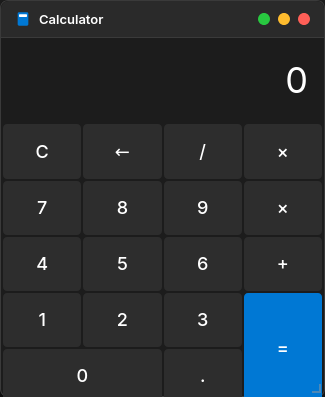
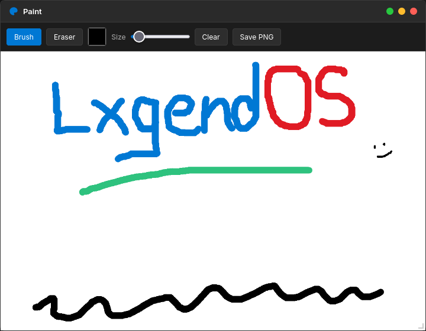
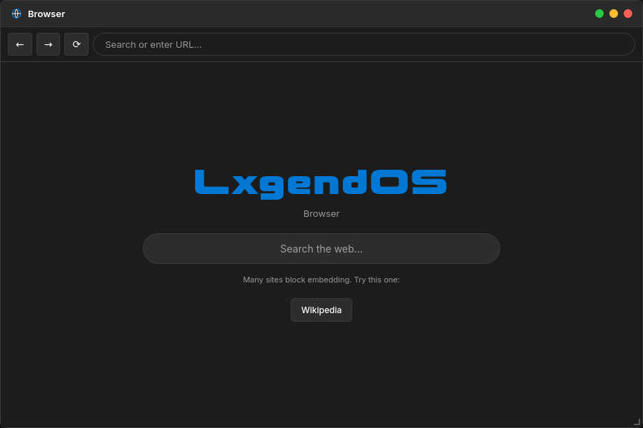
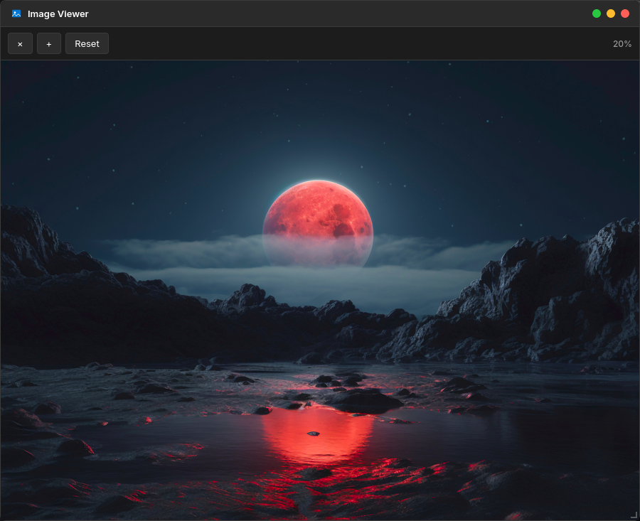
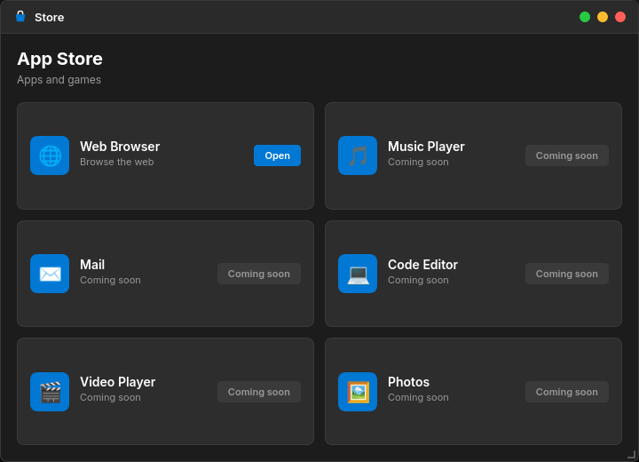
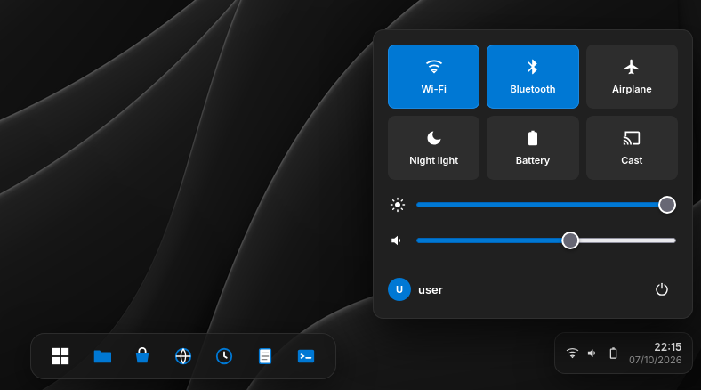
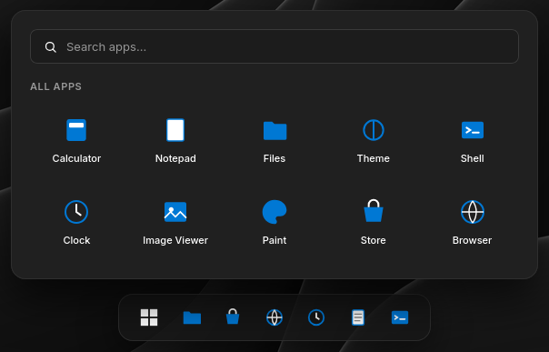
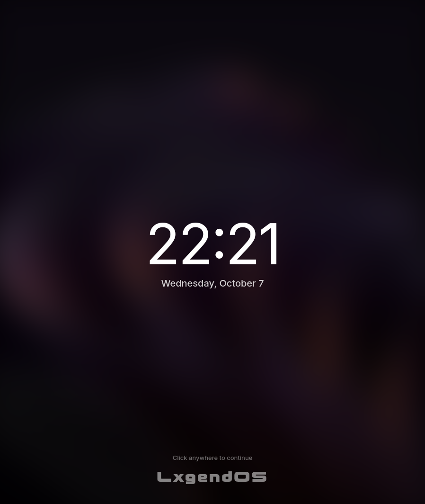

# LxgendOS

A Simple Operating System that runs in your own Browser and includes multiple features and apps into a modern UI.

---

# Try It

Demo Link: https://x-lxg3nd-89.github.io/LxgendOS/

Dependencies - None (It works locally!)

---

# Current features

- **clock** which syncs with your current time

- **Calculator** app for basic numerical operations 

- **Notepad** for writing down stuff and can be saved as text files.

- **Themes** app for chagning wallpaper to a preset image, plain colour, gradient colour OR Import your own bg from computer.

changing the accent colour updates the default 'blue' to your colour system-wide.
- **Paint** for scribbling or any drawing. It supports multi colours.

- **Web Browser** for surfing on the internet (only some sites actually support them running it in as embedded.)

 

Currently, working example it includes is Wikipedia.
- **Shell** for running multiple commands and controlling the OS!

- **Files** includes multiple folders and you can create and save your text files and open it in here

- **Image Viewer** its not a standalone app, you can view images which are in the wallpaper folder.

- **Store** currently only web browser comes pre installed, others will be coming in an upcming devlog

- **Control Panel** It includes basic settings for quick adjusting.

- **Search Bar** you can search your apps

- **Boot Screen**

- All Windows are resizeable
 
---

# Limitations

- No persistence - Closing or reloading the tab resets everything.
- The browser uses an `<iframe>`, so sites with `X-Frame-Options` (Google, YouTube, GitHub, Reddit) refuse to load. Wikipedia works.
-Paint canvas has a fixed internal resolution so the CSS scales it to fit the window
- Alarms use 'alert()' instead of a custom notification UI.

# RoadMap

- localStorage for all variables
- More apps like VSC, Games, etc (some are listed in store)
- Start menu improvements
- Better file management
- More animations and Fx.
 
# Tech Stack

- HTML
- CSS
- JavaScript